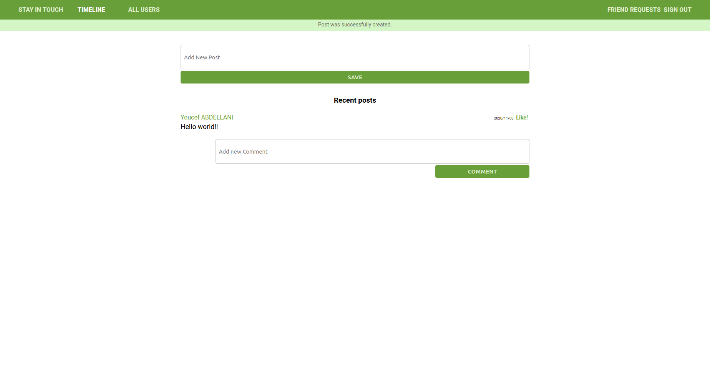

#  🧐 social media app

This is this final collaborative project from the Ruby on Rails module from the Microverse program. It consists of making a social media where you can authenticate, post, comment, like a post and dislike it, also you can send an invitation to friends and the user can accept or decline invitations.



## 🔧 Built With these features
- Ruby. v2.6.6
- Ruby on Rails. v5.2.4
- Using Rubocop Linters.
- Bootstrap

## 🛠 Getting Started
## Install 
 In order to run locally, you need to install Ruby on your computer. For windows, you can go to [Ruby installer](https://rubyinstaller.org/) and for MAC and LINUX you can go to [Ruby official site](https://www.ruby-lang.org/en/downloads/) for instructions on how to install it. Then you can clone the project by typing ```git clone https://github.com/Ceci007/ror-social-scaffold``` on your terminal.

## Run the application
To get a local copy up and running follow these simple example steps.

- Open a terminal
- Copy this code : ```git clone "put the link from github repo"```
- Run the program with this code : ```bundle install```
- before running ```rails server``` you must run a few more commands: first run ```yarn install --check-files```
- Then run ```rails db:create```, ```rails db:migrate```
- now you can run ```rails server```
- Stop the program with: "Ctrl + C" (Windows or Linux) or "Command + C"(Apple)

## Open app in browser

- When the program is running go to your browser
- put: localhost:3000/
- Click on login, register and create a new Event
- Enjoy the app.

## ✒️ Authors
👤 **Cecilia Benitez Casaccia**

- Github: [@Ceci007](https://github.com/Ceci007)
- LinkedIn:[LinkedIn](www.linkedin.com/in/cecilia-benítez)

👤 **Youcef Abdellani**

- Github: [@ABDELLANI-Youcef](https://github.com/ABDELLANI-Youcef)
- LinkedIn:[LinkedIn](linkedin.com/in/youcef-abdellani)

## 🤝 Contributing
Contributions, issues and feature requests are welcome!

Feel free to check the [issues page](https://github.com/Ceci007/ror-social-scaffold/issues).

## 📝 License
This project is [MIT](lic.url) licensed.

